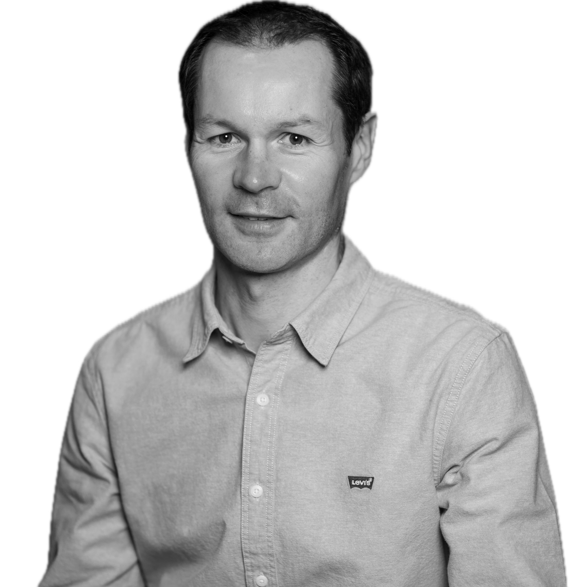

<table style="width: 100%; border-collapse: collapse; border: none;">
  <tr>
    <td style="vertical-align: top; width: 60%; border: none;">

<h2>Aurélien Chalm</h2>

📧 aurelien.chalm@gmail.com  
💼 [www.linkedin.com/in/aurélien-chalm-67b8a845](#)  
🐙 [github.com/aurelienchalm](https://github.com/aurelienchalm)  

  </td>
  <td style="vertical-align: top; text-align: left; width: 40%; border: none;">
    
  </td>
  </tr>
</table>

  <h3>Profil</h3>
  
<strong>Data Engineer en Développement & Data Science</strong>, 10 ans d'expérience en développement backend et gestion de projets data (Talend, SQL, Oracle), complétée par une formation avancée en Data Science, Cloud, IA générative, déploiement, MLOps.

  

<table style="border-collapse: collapse; width: 100%;">
  <tr>
    <td style="vertical-align: top; width: 60%;">

<h4>🛠 Compétences techniques</h4>

<strong>Langages & Outils</strong> : Python (Pandas, NumPy), SQL, PL/SQL, Git, Bash 
<strong>DataViz</strong> : Plotly, Seaborn 
<strong>ETL / Traitement</strong> : Talend Open Studio, PySpark, Databricks 
<strong>API & Scraping</strong> : FastAPI, Scrapy 
<strong>Cloud</strong> : AWS (S3, RDS), GCP (Storage, BigQuery) 
<strong>MLOps & Déploiement</strong> : Docker, MLFlow, Streamlit, FastAPI, Hugging Face 
<strong>Bases de données</strong> : Oracle, MySQL, PostgreSQL, Weaviate (vector DB) 
<strong>ML Supervisé</strong> : Scikit-learn, régressions, arbres de décision, Random Forest, Time Series 
<strong>ML Non supervisé</strong> : KMeans, DBSCAN, PCA, NLP non supervisé, Topic Modeling 
<strong>Deep Learning</strong> : PyTorch, TensorFlow, CNN, Transfer Learning, GANs, Transformers 
<strong>LLM & IA générative</strong> : LangChain, RAG, fine-tuning, embeddings, Weaviate

  </td>
  <td style="vertical-align: top; width: 40%;">

<h4>💼 Expérience pro</h4>

<strong>iQera (2023–2024)</strong> 
Chef de projet EDI - Talend, SQL, Oracle

<strong>MCS Groupe (2012–2019)</strong> 
Dév. Java - Backend, Angular, Jenkins

<strong>Sungard (2000–2011)</strong> 
ASP/Java - Fullstack, SQL, Linux

<h4>🎓 Formation</h4>

Data Science, Alumni Jedha (2025) 
Université de Rouen (1996–2000)

<h4>📁 Projets</h4>
<ul>
  <li>Chatbot LLM (LangChain, RAG)</li>
  <li>Dashboard Streamlit</li>
  <li>Scraper anti-blocage</li>
</ul>

<h4>🌐 Langues</h4>
<ul>
  <li>Français</li>
  <li>Anglais (professionnel lu et écrit)</li>
</ul>

<h4>🏃 Hobbies</h4>
<ul>
  <li>Marathon RP 3h27</li>
  <li>Semi-Marathon RP 1h35</li>
  <li>Trailer 50 KM, 66 KM</li>
</ul>

  </td>
  </tr>
</table>

