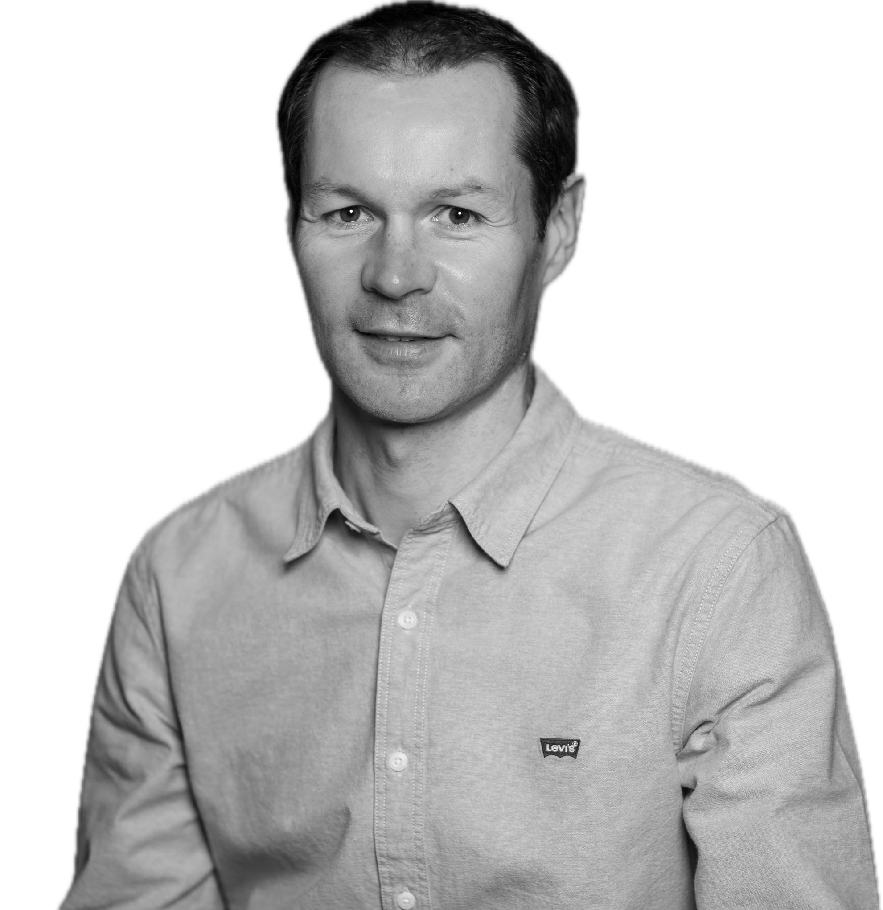

  

    <h2 class="name">Aurélien Chalm</h2>
    
GenAI Engineer | MLOps | AI Architect

  

      
📧 aurelien.chalm@gmail.com

      
📱 06 11 86 30 12

      
💼 <a href="https://www.linkedin.com/in/aurélien-chalm-67b8a845/">LinkedIn</a>

      
🐙 <a href="https://github.com/aurelienchalm">GitHub</a>

    

  

  

  <h3>Profil</h3>
  

    Data Engineer & GenAI Engineer | MLOps | AI Architect, 10 ans d’expérience en développement backend et gestion de projets data
    (Talend, SQL, Oracle), complétés par une formation Data Science (RNCP niveau 6 & 7) :
    Cloud, Machine Learning, Deep Learning, IA générative, déploiement, MLOps,
    Reinforcement Learning et Data Governance.
  

  <h3>Compétences clés</h3>

  
<strong>Python</strong> (Pandas, NumPy, EDA) 

  
<strong>SQL / PL-SQL</strong> 

  
<strong>Git, Bash</strong> 

  
<strong>DataViz</strong> (Plotly, Seaborn, Power BI, Tableau) 

  
<strong>ETL / ELT</strong> (Talend, Airbyte, PySpark, Databricks) 

   
<strong>API & Scraping</strong> (FastAPI, Scrapy) 

  
<strong>MLOps</strong> (Docker, MLflow, Streamlit, Hugging Face, Jenkins, Airflow, Evidently) 

  
<strong>Computing</strong> (Kubernetes, Ray) 

  
<strong>Bases de données</strong> (Oracle, MySQL, PostgreSQL, Weaviate (vector DB), MongoDB) 

  
<strong>ML Supervisé et non supervisé</strong> 

  
<strong>Deep Learning</strong> (TensorFlow, Transfer Learning, Embeddings, Transformers) 

  
<strong>LLM & IA générative</strong> (LangChain, RAG) 

  
<strong>Reinforcement Learning</strong> (Q-Learning, RLHF) 

  
<strong>Cloud</strong> (AWS, GCP) 

  
<strong>Data Governance</strong> (Data Quality, Data Management, Réglementations) 

  

  <h3>Projets Data & IA</h3>
 
  
<strong>Data Science/Engineering</strong> : Chatbot LLM, EDA, scraping, Data Lake & Data Ware House (AWS),
  Databricks, Pyspark, ML, DL, déploiement, data governance, architecture, data drift avec Evidently
 
  
<strong>iQera</strong> : développements de flux financiers (ETL) en sous traitance (clients secteur bancaire).
  Gestion de projets (flux financiers, flux d'actes de gestion (commissaires de justice)).
 
  
<strong>MCS</strong> : développement en Java et PL/SQL de logiciels internes :  
  -encaissement/compta/facturation (recouvrement de créances)
 
  
<strong>Sungard</strong> : développement en Java de l'intranet et d'outils internes (éditeur de logiciels boursiers)

  

  <h3>Expérience professionnelle</h3>

  
<strong>iQera</strong> (2020–2024) 
  Chef de projet Data — Talend, SQL, Oracle

    
  
<strong>MCS Groupe</strong> (2012–2019) 
  Développement Java & PL/SQL — Backend, Angular, Jenkins

  
<strong>Sungard</strong> (2000–2011) 
  ASP / Java — Fullstack, SQL, Linux

  

  <h3>Formation</h3>
  

    Jedha (2025) — Data Science, certifié RNCP niveau 6 & 7 
    Université de Rouen — Maîtrise Bio-Informatique (1996–2000)
  

  

  <h3>Langues</h3>
  
Français • Anglais (professionnel)

  

  <h3>Sport</h3>
  
Marathon 3h27 • Semi-marathon 1h35 • Trail 50–66 km

